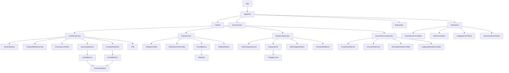
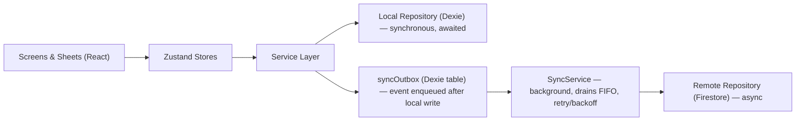
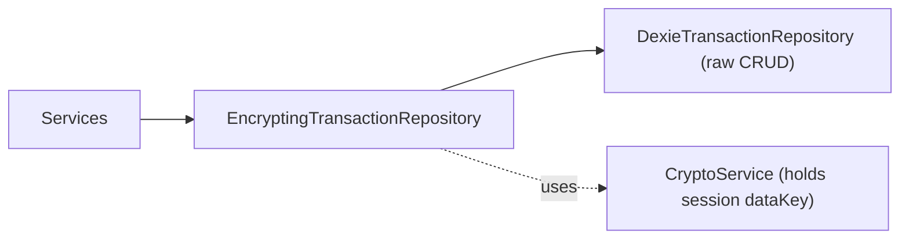

# Personal Finance Planner — Design Document (v1)

Single-user, offline-first, local-first SPA. Mobile-first for iPhone 16 Pro Safari, with a lightweight responsive pass for regular laptop-browser use. Hosted as a static build on GitHub Pages. Local persistence now (Dexie/IndexedDB); Firestore is designed for, not built, in v1 — except the sync **shape** (outbox, cache metadata), which is worth laying down now since it touches the schema.

Sections marked **[ASSUMPTION]** are places I inferred beyond what you said — please confirm or correct those specifically.

---

## 1. Technology Selections

| Concern | Choice | Why |
|---|---|---|
| UI library | React 18 + TypeScript | Type safety across model/service/repository layers |
| Build tool | Vite | Fast, clean static output, trivial GitHub Pages `base` path config |
| State management | Zustand | Thin, no boilerplate, plays well with a service layer underneath |
| Styling | CSS Modules | One `.module.css` per component — zero styling logic in JSX |
| Local persistence | Dexie.js (IndexedDB) | Async, promise-based, good TS support |
| Cloud persistence | Firebase Firestore | Interface + outbox shape designed now; `FirestoreRepository` implementations come later |
| Sync boundary | Local Dexie writes synchronous; remote pushed via a persisted **outbox queue** | See §5 — no new library, just a Dexie table + a small `SyncService` |
| Routing | None — tab state in the UI store | 4 tabs + sheets; avoids GitHub Pages subpath/deep-link complexity |
| Annual Summary visuals | Plain HTML tables (monthwise + category), no charting library | Readable on a phone with compact amounts; add a chart library later only if a visual trend view is wanted |
| Date handling | date-fns **[ASSUMPTION — easy to swap]** | Tree-shakeable |
| ID generation | nanoid **[ASSUMPTION — easy to swap]** | Small, collision-safe, offline-safe |
| Hosting/CI | GitHub Pages via GitHub Actions | Free, matches "low-cost git-like platform" |
| Testing | Vitest + React Testing Library **[ASSUMPTION, not elaborated below]** | Native Vite pairing, not load-bearing |

---

## 2. Domain Model

### 2.1 The planned-vs-actual rule

Every transaction carries two things that decide planned vs. actual:

- **`date`** — the operative date. Defaults to *today* at entry time unless changed. Drives month/year bucketing.
- **`statusKind`** — a fixed, code-level marker: `'planned' | 'actual'`. Structural — the dashboard's balance math and Upcoming/Completed split depend on it.

`statusKind` is **freely bidirectional**, via one unified control in the transaction sheet — not a one-way "mark as paid." It can be set directly at creation time too (logging something already paid skips the planned step entirely), and an already-`actual` transaction can be moved back to `planned` (undo). basic-usecases.txt Cashflow #7.

Status is **not Master Data**: `'planned' | 'actual'` (shown as Planned / Completed) is the complete, fixed list, defined in code. There is no separate cosmetic status label and no user-defined status. The row pill is derived from `statusKind` alone. (`features/master-data.feature`)

### 2.2 Master Data — two two-level hierarchies

Behaviour is specified in `features/master-data.feature`. Master Data holds two hierarchies built from the same `MetadataGroup` → `MetadataItem` primitive:

| Hierarchy | Group (parent) | Item (leaf) | Who manages it |
|---|---|---|---|
| Categories | `key: 'category'`: Housing, Essentials, Income… | sub-category: House Rent, Grocery… | User: add, rename, recolour, archive |
| Payment | `key: 'paymentMode'`: exactly six fixed groups (Credit Card, Debit Card, UPI, Net Banking, Cash, Wallet) | instrument: "HDFC Regalia ••4321", "GPay (SBI Savings)" | Modes are system-defined and immutable. Instruments are user-managed, except the built-in "Cash" instrument |

Rules that keep every unit consistent:

- **Only the leaf is stored.** Transactions and rules record `subCategoryId`, and optionally `instrumentId`. The category and payment mode are always **derived** through the item → group index, never stored, so they can't disagree. Item ids are globally unique (nanoid), so a leaf id alone resolves its parent.
- **A leaf never changes parent.** A sub-category can't move to another category, and an instrument can't move to another mode. Otherwise derived history would silently re-file.
- **Type is independent of category.** `type` lives on the transaction or rule; any sub-category may be used for income or expense.
- **Archive, never delete, once used.** Groups and items carry `archived`. Archived entries are hidden from pickers but always resolvable for display and aggregation. Archiving a category archives its sub-categories; restoring a sub-category restores its parent. Permanent deletion is allowed only while `firstUsedAt` is unset. That flag is stamped the first time any transaction or rule version references the entry, and never cleared, so "ever used" survives the deletion of the transaction that used it.
- **No sensitive numbers.** Master Data is stored unencrypted (§8.1). An instrument holds a nickname plus optional `last4` (exactly 4 digits). A nickname containing a run of more than 4 digits is rejected.
- **No other enumerations in v1.** The old `status` and `account` groups are gone. Custom user-defined groups are out of scope. Payment mode and instrument are descriptive only: no balances or transfers in v1.
- **Seeding** happens on first run only. Starter categories come with their sub-categories; the six payment modes come with the system "Cash" instrument under Cash.

```ts
interface MetadataGroup {
  id: string;
  key: 'category' | 'paymentMode';
  systemCode?: 'creditCard' | 'debitCard' | 'upi' | 'netBanking' | 'cash' | 'wallet'; // paymentMode groups only
  name: string;
  icon: string;
  color: string;
  isSystem: boolean;      // true for the six payment modes: cannot be added, renamed, reordered, archived or deleted
  archived: boolean;      // categories only
  firstUsedAt?: string;   // set on first reference by any transaction/rule (via its items); never cleared
  items: MetadataItem[];
  order: number;
  createdAt: string;
  updatedAt: string;
}

interface MetadataItem {
  id: string;             // globally unique — a leaf id alone identifies its parent group
  label: string;          // sub-category name, or instrument nickname (unique among siblings, case-insensitive)
  last4?: string;         // instruments only: exactly 4 digits, displayed as "label ••1234"
  isSystem?: boolean;     // the built-in "Cash" instrument
  order: number;
  archived: boolean;
  firstUsedAt?: string;   // set on first reference; deletion allowed only while unset
}
```

### 2.3 Transaction

```ts
interface Transaction {
  id: string;
  title: string;
  plannedAmount: number;        // what was planned; 0 when created directly as completed (unplanned)
  actualAmount?: number;        // what was actually paid/received; set only while statusKind is 'actual'
  type: 'income' | 'expense';
  subCategoryId: string;       // → MetadataItem.id under a 'category' group; category is derived
  date: string;                 // ISO date; auto = entry date unless changed
  statusKind: 'planned' | 'actual';
  instrumentId?: string;        // → MetadataItem.id under a 'paymentMode' group; payment mode is derived
  notes?: string;
  ruleId?: string;               // exact rule VERSION that spawned this
  ruleGroupId?: string;          // full rule LINEAGE — survives rule edits (see 2.4)
  monthKey: string;              // 'YYYY-MM', indexed
  year: number;                   // indexed
  createdAt: string;
  updatedAt: string;              // last-write-wins sync key
}
```

### 2.4 Recurring Rule — versioned content, mutable status

**Content** (name, description, type, category, amount, schedule, endDate) is immutable — every content edit produces a new row, never an in-place update. **Status** is the one deliberate exception: pause/resume/cancel mutate the current row's `status` **in place**, with no new version, no history entry (rule-usecase.xt #2 lists only amount/date/frequency as version-triggering — status isn't one of them).

**Status** (`RuleStatus`):

| Status | Meaning | Set by |
|---|---|---|
| `active` | Normal — contributes computed occurrences going forward. | Create; Resume |
| `paused` | Temporarily suspended — contributes nothing until resumed. | User (Pause) |
| `cancelled` | Terminal — user-cancelled, *or* the automatic result of a chain-break's old lineage. Contributes nothing, ever again. | User (Cancel); automatic on chain-break |
| `deprecated` | Automatic — superseded by a newer version in the *same* lineage. Still contributes occurrences for any "gap" months its window covers that the newer version doesn't reach yet. | Automatic on an in-lineage revision |
| `expired` | Automatic, stored (not merely computed) — today has passed this rule's own `endDate`. Informational: the `endDate` itself already bounds which months produce an occurrence (§2.5), so this status doesn't need to gate anything further. | `RuleService.list()`, lazily, the first time it notices |

Two outcomes for a *content* edit, depending on what changed:

- **New version, same lineage** — amount or schedule (`dayOfMonth`/cadence) changed. Gets the next `version` number, same `ruleGroupId`, `effectiveFrom` = the date you pick (defaults to today). The superseded row's `effectiveTo` is set to that same date (exclusive), `supersedesId` links back, **and its `status` is force-set to `deprecated`** regardless of what it was.
- **New lineage entirely** — **`name`, `subCategoryId`, or `type`** changed. Gets a brand-new `ruleGroupId`, `version: 1`, no `supersedesId`, no `effectiveTo` (a separate lineage, not a closed date range). The new lineage's initial `status` **inherits** the old lineage's pre-supersede status. The **old** lineage's current row is **force-set to `cancelled`** — terminal, unlike `deprecated`. `description` or `instrumentId` changing alone is non-breaking — a new version in the same lineage, like amount/schedule.

```ts
interface RecurringRule {
  id: string;                    // unique per version
  ruleGroupId: string;           // stable across versions in one lineage
  version: number;                // 1-based within the group
  effectiveFrom: string;          // ISO date — when this version starts applying
  effectiveTo?: string;           // ISO date, exclusive — set once superseded within the lineage
  supersedesId?: string;          // previous version's id, same group

  name: string;                   // chain-breaking if changed
  description?: string;
  type: 'income' | 'expense';      // chain-breaking if changed
  subCategoryId: string;            // chain-breaking if changed ("tag"); category derived
  instrumentId?: string;            // versions, doesn't break chain; pre-fills completed occurrences

  amount: number;                   // versions, doesn't break chain
  repeats: 'monthly' | 'quarterly' | 'yearly';
  dayOfMonth?: number;               // for 'monthly' and 'quarterly'
  monthOfYear?: number;               // 'yearly': fires in this month. 'quarterly': start month (fires every 3rd month from here)
  startDate: string;
  endDate?: string;                   // undefined = never-ending; bounds which months produce an occurrence
  status: 'active' | 'paused' | 'cancelled' | 'deprecated' | 'expired';

  createdAt: string;
  updatedAt: string;
}
```

`RuleRepository` exposes `save` (always an insert of a new row for content) and reads, plus exactly one mutation: `updateStatus(id, status)` — the single, narrow exception to immutability, scoped to that one field. `status` is one of the *clear* (unencrypted) columns on the stored record (§8.1), so this mutation never touches `cipherPayload`.

### 2.5 Rule execution — computed, never stored

**Rule-derived planned occurrences are never persisted.** Every time a month is viewed, `computeVirtualPlannedTransactions(allRuleVersions, year, month)` — a pure function, no I/O — recomputes them fresh from whatever the rules currently say. There is nothing to keep in sync, migrate, or dedupe, because nothing is ever written until something becomes concrete.

Per rule group, for a target month:

1. Find the version whose window covers the month: `effectiveFrom <= monthStart`, `(!effectiveTo || effectiveTo > monthStart)`, **and** `(!endDate || endDate >= monthStart)`. If none does, this group contributes nothing.
2. If that version's `status` is `paused` or `cancelled`, contribute nothing — regardless of its window. `active`, `deprecated`, and `expired` all may contribute; `deprecated` naturally only wins the month-1 check for gap months before a newer version's `effectiveFrom`, and `expired` is already bounded by its own `endDate` in step 1, so neither needs a separate carve-out.
3. Otherwise compute the occurrence date and emit a virtual `Transaction`: `statusKind: 'planned'`, `id: `virtual:${ruleId}:${monthKey}`` (synthetic — recognizable, deterministic, never written to Dexie), `ruleId`/`ruleGroupId` set for traceability.

`TransactionService.getForMonth(year, month)` merges this with whatever's genuinely stored for the month (adhoc planned entries, and anything completed): a virtual occurrence is suppressed wherever a real row already exists for that `ruleGroupId` this month (i.e. it's already been completed).

**Completing** a virtual occurrence is the *only* way it ever becomes a real row: `TransactionService.create()` is called with its `ruleId`/`ruleGroupId` carried over and `statusKind: 'actual'`. Editing a virtual occurrence without completing it isn't supported (rule-usecase.xt) — change the rule itself for future occurrences, or complete this one.

This design is what makes a chain-break trivial: the old (now `cancelled`) lineage contributes nothing from the moment it's cancelled, in *any* month, so there's no double-computation risk with the new lineage — no migration, no predecessor-chain lookup, no concurrency guard needed anywhere in this path, because nothing is ever written for a still-planned occurrence in the first place. A `Transaction` only ever exists in Dexie once it's real: an adhoc entry, or something completed.

**Amounts** (`features/transactions.feature`): a planned row records `plannedAmount`. Creating a row directly as completed with no rule behind it records `plannedAmount: 0` and `actualAmount` = the entered value. Completing a planned row, whether stored or virtual, keeps `plannedAmount`; `actualAmount` defaults to it unless edited. Moving back to planned clears `actualAmount` and leaves `plannedAmount` as it was. A virtual occurrence carries the rule version's `amount` as `plannedAmount`.

**Annual Summary note**: rule occurrences are still never stored. The FY summary (§7) is a separate *derived* document: persisted, and recomputed by an event handler after every transaction or rule write. Rule occurrences only ever feed into that aggregate; none is ever written as a transaction.

---

## 3. Folder Structure

```
src/
  app/                    # shell composition, tab switching
  components/             # dumb presentational primitives — Card, Pill, IconBadge,
                           # BottomSheet, FormField, ToggleGroup, ChipInput, Button,
                           # ScrollableList (shared scroll container)
  screens/
    Cashflow/              # MonthSelector, ProjectedBalanceCard, SummaryCard,
                            # TransactionSection (scrollable), TransactionRow
    Rules/                 # RuleSearchBar, RuleStatusFilterChips, RuleRow (scrollable list)
    MasterData/            # TotalCategoriesCard, CategoryGrid, CategoryCard, PaymentModeList,
                            # ArchivedToggle
    AnnualSummary/          # FiscalYearSelector, AnnualTotalsCard, MonthlyBreakdownTable,
                            # CategoryBreakdownTable
    sheets/                 # TransactionFormSheet, RuleFormSheet, CategoryFormSheet (+ sub-categories),
                            # InstrumentFormSheet
  stores/                  # Zustand: uiStore, transactionStore, ruleStore,
                            # metadataStore, annualSummaryStore
  services/                # TransactionService, RuleService, RuleEngineService,
                            # MetadataService, BalanceService, SyncService
  repositories/
    interfaces/             # TransactionRepository, RuleRepository, MetadataRepository
    dexie/                  # db.ts (schema), Dexie*Repository implementations,
                            # DexieSyncOutbox, DexieCacheMeta
    firestore/               # placeholder only — not implemented in v1
  models/                   # pure TS types, zero React/UI imports (2.2–2.4 above)
  utils/                    # date helpers, id gen, currency formatting
  index.css                 # design tokens (CSS variables for the PDF's palette)
```

---

## 4. Component Tree



Shared primitives: `Card`, `Pill`, `IconBadge`, `BottomSheet`, `FormField`, `SelectField`, `ToggleGroup`, `ChipInput`, `IconPicker`, `ColorPicker`, `Button`, `ScrollableList`.

**Interaction rules:**
- Tapping the FAB, a `TransactionRow`, a `RuleRow`, or a `CategoryCard` sets `uiStore.activeSheet = { type, mode: 'create'|'edit', targetId }`. `SheetHost` renders the matching sheet.
- Screens/rows are **presentational + store-bound only** — never call services or repositories directly.
- Sheets submit to the relevant **Service**; the store's action wraps that call and updates local state on success.
- **`ScrollableList`** is a fixed-height, `overflow-y: auto` container wrapping `UpcomingSection`, `CompletedSection`, and the Rules list — so the page header and balance card stay pinned while long lists scroll independently. Plain scroll, not virtualized; revisit with `react-window` only if list sizes grow well beyond a typical month's/ruleset's item count.
- **`SummaryCard`** (Income/Expense, used on both Cashflow and Annual Summary): **Actual is the large/primary figure; Planned is the small subtext** — inverted from the source PDF per your instruction.

---

## 5. State → Service → Repository → Sync Flow



- **Stores**: UI-bound state only (current month's data, loading/error, active tab/sheet). No persistence logic, no business rules.
- **Services**: own business logic — rule materialization (2.5), balance/aggregation math, validation. Depend only on repository **interfaces**.
- **Local write path is synchronous**: a Service calls `LocalRepository.save()`, awaits it, the store updates — the UI reflects the change immediately, online or offline.
- **Remote write path is queue-based**: on successful local write, the Service also appends an entry to `syncOutbox` (`{ entityType, entityId, op, payload, createdAt }`). A single background `SyncService` — not the repositories themselves — drains this queue FIFO and calls the matching `FirestoreRepository` method per entry, deleting the entry on success and retrying with backoff on failure (including "offline" as a retryable failure). This is the lighter of the two models you offered: repositories stay plain CRUD; only the genuinely unreliable boundary (network) is event/queue-driven.

```ts
interface TransactionRepository {
  getByMonth(year: number, month: number): Promise<Transaction[]>;
  getById(id: string): Promise<Transaction | undefined>;
  getByRuleId(ruleId: string): Promise<Transaction[]>;
  getByRuleGroupId(ruleGroupId: string): Promise<Transaction[]>;   // full lineage history
  save(tx: Transaction): Promise<void>;
  delete(id: string): Promise<void>;
}
// RuleRepository (save = insert-only for content, plus updateStatus — see 2.4),
// MetadataRepository follow the same read/write shape
```

---

## 6. Persistence

### 6.1 Dexie schema (v1 → v3)

```ts
db.version(1).stores({
  transactions: 'id, monthKey, year, ruleId, ruleGroupId, categoryId, statusKind, updatedAt',
  rules: 'id, ruleGroupId, status, categoryId, effectiveFrom, updatedAt',
  metadataGroups: 'id, key, updatedAt',
  syncOutbox: '++localSeq, entityType, entityId, op, createdAt',
  monthCacheMeta: 'monthKey, lastAccessedAt',
});

// v2 — additive only
db.version(2).stores({
  fySummaries: 'fyStartYear, updatedAt',   // derived FY summary documents (§7); figures in cipherPayload
});

// v3 — leaf-only Master Data (§2.2): index the sub-category, not the category.
// Index change only; v1 started from a clean database, so no data upgrade.
db.version(3).stores({
  transactions: 'id, monthKey, year, ruleId, ruleGroupId, subCategoryId, statusKind, updatedAt',
  rules: 'id, ruleGroupId, status, subCategoryId, effectiveFrom, updatedAt',
});
```

### 6.2 Firestore shape (future, not built in v1)

Each Dexie table maps 1:1 to a Firestore collection, document ID = same `id`. Every record carries `updatedAt`; sync uses **last-write-wins by `updatedAt`**.

### 6.3 Data lifecycle & cache eviction (future — Firestore era)

Firestore is the system of record; Dexie is a **working-set cache scoped to the current fiscal year (Apr–Mar)**, purely to bound local storage. Nothing is ever lost — eviction only ever removes data that is already durably in Firestore.

- **Retention rule**: local Dexie holds transactions for the current FY only — from that FY's April through whatever months have data (including months already ahead of "today," e.g. a Dec 2026 transaction materialized in Sep 2026 stays local, since it's within the same FY). Example: on 24 Sep 2026, Dexie holds Apr 2026 – Mar 2027 transaction data; nothing from FY2025-26 or earlier.
- **FY rollover**: the first time the app runs after the real-world date crosses into a new FY (e.g. 1 Apr 2027), a sweep purges every transaction whose `monthKey` falls outside the new current FY. Local storage then holds only Apr 2027 onward, starting the cycle again.
- **Navigating to a prior-FY month**: fetched from Firestore on demand and cached in Dexie for a smooth session (fast re-visits, works if you flip back and forth), but it's transient — the next FY-rollover sweep purges it again like any other out-of-FY data. It is never re-pushed to Firestore (it came from there).
- **Every write** goes through the outbox (§5) regardless of which FY it belongs to, so Firestore always converges even if the affected month gets evicted locally moments later.
- Rules and Master Data are **never evicted** — small, and needed globally for materialization/dropdowns regardless of which month or FY is open.
- `monthCacheMeta` (`monthKey, lastAccessedAt`) still exists mainly to know *which* months are currently cached (so the UI can decide "fetch from Firestore" vs "read local") — the sweep's actual trigger is the FY boundary, not `lastAccessedAt` age.

---

## 7. Annual Summary Screen (new — FY Apr–Mar)

Confirmed. Added as a 4th bottom-nav tab. Content, modeled on the Cashflow screen's visual language:

- **`FiscalYearSelector`** — `‹ FY 2026–27 ›`, April-to-March range.
- **Definitions** — *Planned* = sum of `plannedAmount` over computed rule occurrences, saved planned transactions and completed transactions. A transaction completed with no prior plan contributes 0. *Committed* = sum of `actualAmount` over completed (`statusKind: 'actual'`) transactions only. Committed can therefore **exceed** planned (overspend, or unplanned spending). *Net* = income − expense, for each. The Cashflow cards use the same meaning: headline = committed, "Planned" subtext = planned. Projected balance counts each row's actual amount once completed, otherwise its planned amount.
- **`AnnualTotalsCard`** — Income / Expense / Net rows, each with planned and committed, for the whole FY.
- **`MonthlyBreakdownTable`** — one row per month Apr…Mar plus an FY total row; planned and committed for income, expense and net. Current month highlighted; tapping a row opens that month on Cashflow.
- **`CategoryBreakdownTable`** — one row per top-level category (`MetadataGroup` with `key: 'category'`, archived ones included), split into Income and Expense sections with section totals; planned, committed and share-of-section %. Each category's figures are the sum of its sub-categories (derived parent). Ordered by planned descending; zero rows hidden; ids that resolve to nothing roll up into "Uncategorised".

Behaviour is specified in `features/annual-summary.feature`.

**Data layer — persisted, event-driven summary document**: the screen reads one `FiscalYearSummary` document per FY from `fySummaries` (encrypted like transactions, §8.1). The document holds 12 months × {income, expense} × {planned, committed}, plus per-type totals keyed by `subCategoryId`. Rolling sub-categories up to their category, and resolving names, icons and colours, happens at render. A leaf never changes parent, so this roll-up is stable, Master Data edits show without a recompute, and unknown ids roll into "Uncategorised".

- `TransactionService`/`RuleService` emit a domain event (`services/domainEvents.ts`) after every successful write. The emit is **awaited**, so a write resolves only once the summary is current.
- `FiscalYearSummaryService` handles those events. A transaction write recomputes the FY of the old and new date. A rule write (create/revise/status/delete) recomputes every stored FY plus the current FY, because a rule can shift occurrences in any year. The `list()` expiry stamp emits nothing, since it changes no occurrence.
- Recompute = `BalanceService.buildAnnualSummary(fy)`: one rule read, one `getByMonthRange` over the FY, 12 × `computeVirtualPlannedTransactions` merged with stored rows (`mergeStoredWithVirtual`, shared with Cashflow), then the pure `summarizeFiscalYear`.
- A missing document is built on first read. Documents are derived data and never enter `syncOutbox`; each device rebuilds its own. Prior-FY data comes from local storage only in v1 (the Firestore fetch in §6.3 is future work).

---

## 8. Local Authentication & Encryption at Rest

Per your instruction: the local key both **gates** the app and **encrypts** the Dexie data, using an **alphanumeric passphrase**. Google-account login is a later phase, layered on top without disturbing this.

### 8.1 What's encrypted vs. what stays queryable

Dexie/IndexedDB can't query ciphertext, so encryption is **field-level**, not whole-record: fields the app needs to index or filter by stay in the clear; the sensitive payload is encrypted as one blob per record.

| Entity | Encrypted (`cipherPayload`) | Clear (stays indexed) |
|---|---|---|
| `Transaction` | `title`, `plannedAmount`, `actualAmount`, `notes`, `instrumentId` | `id`, `monthKey`, `year`, `subCategoryId`, `statusKind`, `ruleId`, `ruleGroupId`, `updatedAt` |
| `RecurringRule` | `name`, `amount`, `description`, `instrumentId` | `id`, `ruleGroupId`, `version`, `subCategoryId`, `status`, `effectiveFrom`, `updatedAt` |
| `MetadataGroup`/`MetadataItem` | — none | everything — labels only. Instruments hold a nickname + last 4 digits, never a full card/account number (§2.2) |

**Trade-off, explicitly flagged**: anyone with direct IndexedDB access can still see *which categories* you transacted in, *when*, and *how many* transactions — but not titles, amounts, or notes. Full-record encryption would hide categories/dates too, but would also make month/status queries impossible without decrypting the entire table on every read. This is the standard practical middle ground for an encrypted local-first app; flag it if you want full-record encryption instead (bigger change: every list query becomes decrypt-then-filter in memory).

### 8.2 Key derivation & unlock flow

- **First run**: user sets a passphrase. Generate a random salt. Derive two independent values via PBKDF2-SHA256 (≥210,000 iterations, Web Crypto `SubtleCrypto`), never the passphrase itself is stored:
  - `verificationHash` — stored locally, used only to check a re-entered passphrase is correct.
  - `dataKey` — an AES-GCM 256 key, held **only in memory** for the session (module-level, not in Zustand/devtools-visible state), used by the repository decorators (8.3). Re-derived from the passphrase on every unlock; never persisted anywhere.
- **Every subsequent app open**: `UnlockScreen` prompts for the passphrase; `CryptoService` re-derives `verificationHash` and compares; on match, derives and holds `dataKey`, sets `authStore.isUnlocked = true`.
- **Accepted risk**: there is no recovery path in v1 — a lost passphrase means the locally encrypted data is unrecoverable (Firestore, once built, becomes the actual recovery path via re-sync after Google sign-in).

### 8.3 Where this lives in the architecture

Encryption is implemented as a **repository decorator**, so it's invisible above the repository layer — Services still just see a `TransactionRepository`/`RuleRepository` interface:

```
EncryptingTransactionRepository implements TransactionRepository
  wraps → DexieTransactionRepository
  save(tx):    split clear/sensitive fields → encrypt sensitive blob with dataKey → inner.save(record)
  getByMonth(): inner.getByMonth() → decrypt each record's cipherPayload → return full Transaction[]
```



New pieces added to §3's folder structure:
- `services/CryptoService.ts` — key derivation, encrypt/decrypt primitives
- `services/AuthService.ts` — first-run setup, unlock/verify, lock
- `stores/authStore.ts` — `{ isUnlocked, hasPassphraseSet }` only — never the key itself
- `screens/Auth/UnlockScreen.tsx` — first-run "set passphrase" form / returning "enter passphrase" form
- `repositories/dexie/encrypting/` — `EncryptingTransactionRepository.ts`, `EncryptingRuleRepository.ts` (MetadataRepository stays unwrapped — nothing to encrypt)
- `App` renders `UnlockScreen` **or** `AppShell`, gated on `authStore.isUnlocked` — nothing else mounts until unlocked.

### 8.4 Dexie schema addition

```ts
db.version(1).stores({
  // ...existing tables (§6.1)...
  authConfig: 'id',   // single record: { id: 'default', salt, verificationHash }
});
```

### 8.5 Forward note — Google-account login (later phase)

Firebase Auth (Google Sign-In) will primarily gate the **Firestore sync boundary** — the resulting `uid` becomes the partition key for your cloud data (e.g. `/users/{uid}/transactions/{id}`), so Firestore security rules enforce it's only ever your own data. Whether the local passphrase lock stays as an *additional* defense-in-depth layer once Google auth exists, or is retired in favor of relying on device-level security + Firestore rules, is a decision for that phase — not blocking now, and nothing in §8.1–8.3 needs to change either way.

---

## 9. Open Questions

None outstanding.

1. ✅ Chain-breaking fields confirmed: `name`, `subCategoryId`, `type`. `description` or `instrumentId` alone is non-breaking.
2. ✅ Annual Summary layout confirmed as proposed.
3. ✅ No separate outbox-pruning concern — `syncOutbox` entries are deleted immediately on successful push (§5); eviction (§6.3) is entirely FY-boundary driven, not age-based.
4. ✅ Local login confirmed as gate + encrypt-at-rest, alphanumeric passphrase (§8).
5. ✅ Master Data (2026-10-01): status is fixed in code (no labels); transactions/rules store the sub-category and optional instrument only, with parents derived; archive-never-delete once used; type is independent of category; payment modes are fixed and system-defined, with user-managed instruments; payment info is descriptive only (no balances) in v1; no custom groups.

---

*Design validated. Proceeding to scaffold.*
